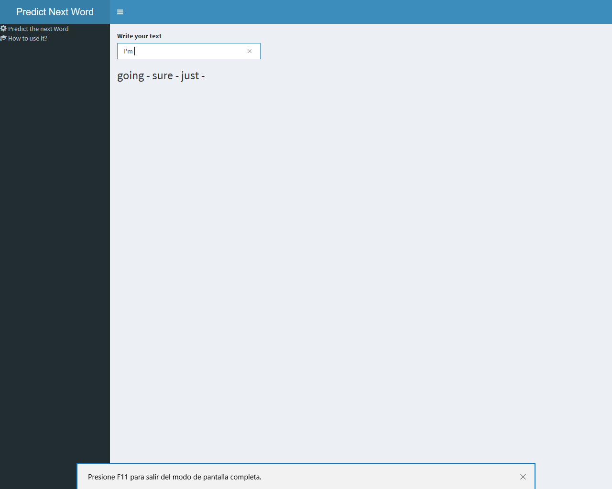

```{r setup, include=FALSE}
knitr::opts_chunk$set(echo = FALSE)
```

## Overview

This document presents the shiny application developed as project to **Coursera Data Science Capstone** in collaboration with **SwiftKey**.

The application predicts the next word to type as it happens on the mobile keyboard you use everyday.

The base of the application are data sets obtained from twitter, news and blogs.

You can use it by clicking [here](https://jmpenyas.shinyapps.io/predictNextWord/).


## N-gram creation & Cleaning
Operations performed over data sets provided:

- 5 % Random data sampling, sample merging and cleaning: removing words and chars that could affect the prediction.

- Creation of *N-grams* of 1, 2 and 3 characters with their datasets with N-grams and its frequency, filtering frequencies lesser than 2.

- Decomposition of the N-grams on its words and stemming of them but the last one in order to get a better prediction.

- Saving the 3 data sets on RData format to be used by prediction model script on shiny application.


## Algorithm

The application uses a [Katz Backoff](https://en.wikipedia.org/wiki/Katz%27s_back-off_model) algorithm for the prediction and it applies over the 3 RData files generated before.

- It applies the same cleaning performed over the sample data.   
- It extracts the last 2 words of the input.   
- It searches which trigrams matches on their 2 first words with the input returning the most frequent trigrams.  
- If it doesn't match, the same operation will be done with last word and the bigrams.   
- If no match found, it will return the most frequent unigrams.


## Interface

Clicking on *Predict the next word* menu, you can type the text you want. The prediction will appear under the text box. It will show the words more frequent on the n-gram database the application has.




